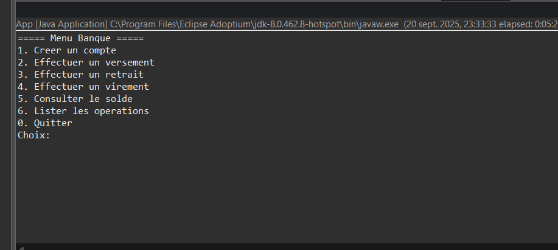

# Application Bancaire - Java 8

Une application console simple en Java 8 pour la gestion de comptes bancaires.

## Description
Cette application permet de gérer des comptes bancaires avec deux types :
- **Compte Courant** : avec découvert autorisé, pas d'intérêts
- **Compte Épargne** : avec taux d'intérêt, pas de découvert

## Fonctionnalités
- Créer un compte (code généré automatiquement)
- Effectuer des versements
- Effectuer des retraits (avec règles métier)
- Effectuer des virements entre comptes
- Consulter le solde
- Lister les opérations d'un compte

## Structure du projet
```
src/
├── bank/
│   ├── model/          # Classes métier
│   │   ├── Compte.java (classe abstraite)
│   │   ├── CompteCourant.java
│   │   ├── CompteEpargne.java
│   │   ├── Operation.java (classe abstraite)
│   │   ├── Versement.java
│   │   └── Retrait.java
│   └── ui/
│       └── App.java    # Interface console
```

## Règles métier
- **Compte Courant** : retrait possible jusqu'au découvert autorisé
- **Compte Épargne** : retrait seulement si solde suffisant
- Codes de compte : format CPT-00001, CPT-00002, etc.
- Montants : strictement positifs

## Compilation et exécution

### Prérequis
- Java 8 (JDK 1.8)

### Compilation
```bash
javac -d out -source 1.8 -target 1.8 -cp src (Get-ChildItem -Recurse src -Filter *.java).FullName
```

### Exécution
```bash
java -cp out bank.ui.App
```

### Créer un JAR
```bash
jar -cvfe bank-app.jar bank.ui.App -C out .
java -jar bank-app.jar
```

## Utilisation
1. Lancer l'application
2. Choisir une option dans le menu
3. Suivre les instructions à l'écran
4. Les codes de compte sont générés automatiquement

## Exemple d'utilisation
1. Créer un compte courant : Type C, solde 1000, découvert 500
2. Code généré : CPT-00001
3. Verser 200€ depuis "Salaire"
4. Retirer 300€ vers "Distributeur"
5. Virement de 100€ vers un compte épargne

## Note
- Les données sont stockées en mémoire (perdues à la fermeture)
- Format des dates : Java Time API (LocalDateTime)
- Utilisation de BigDecimal pour la précision monétaire

## Screenshots
